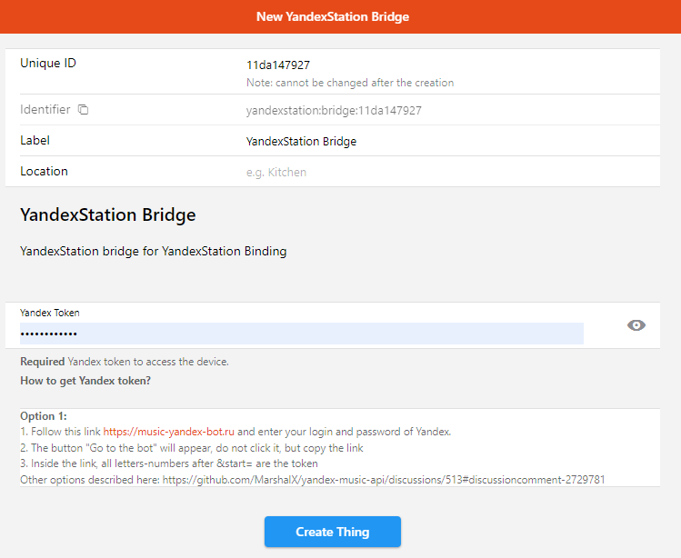
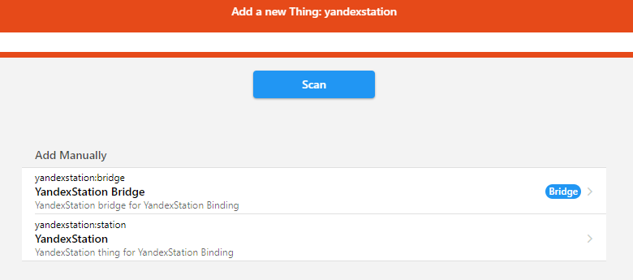
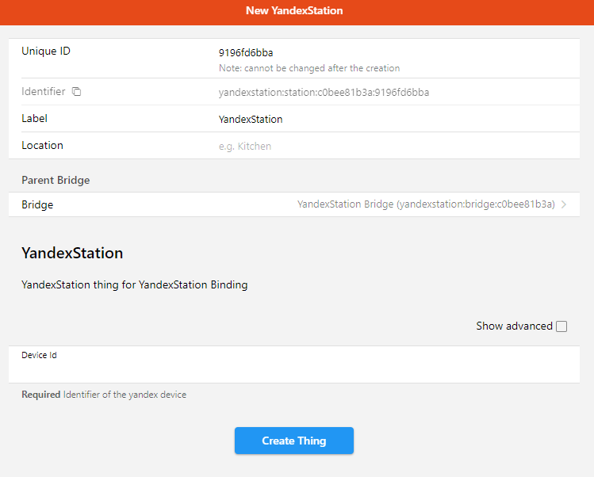
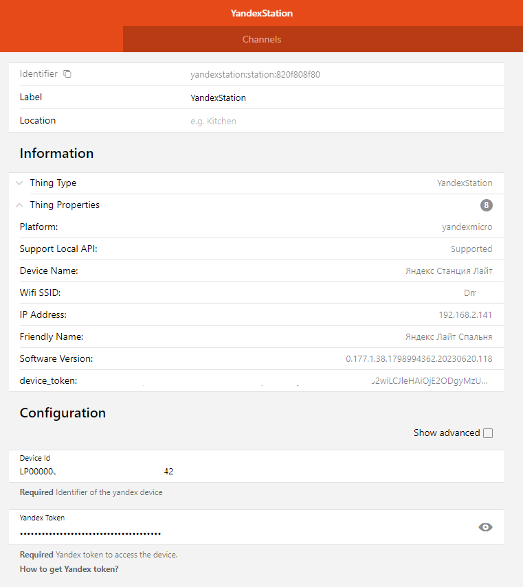
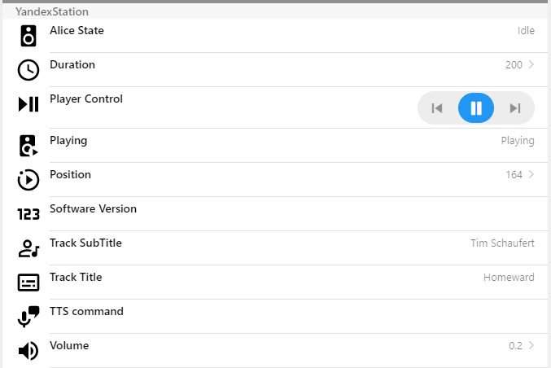
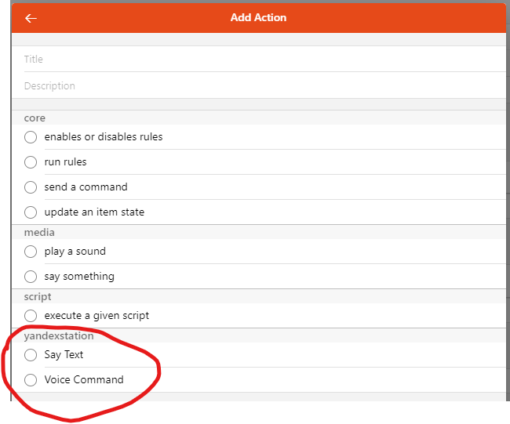
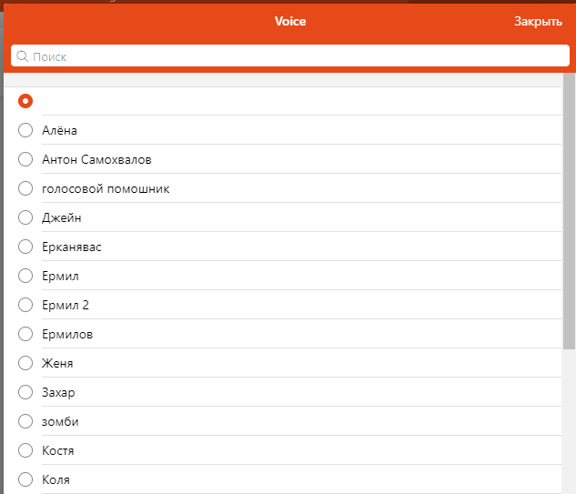

# YandexStation Binding

Binding для локального управления устройствами Яндекс:

- Яндекс Станция
- Яндекс Станция мини
- Яндекс Станция мини 2
- Яндекс Станция лайт
- Яндекс Станци Макс
- Яндекс Модуль
- Яндекс Модуль - 2
- JBL Link Music
- JBL Link Portable

## Discovery

Доступен сервис Discovery. 

Предварительно создайте **_YandexStation Bridge_** и настройте его, указав **_Yandex Token_**.

### Как получить яндекс-токен

#### Вариант 1:
- использовать https://music-yandex-bot.ru
- на страничке ввести логин и пароль
- в старых чужих инструкциях информация отличается, на текущий момент, надо жать кнопку Войти, но не переходит в бота, так же появиться кнопка Скопировать токен




Затем перейтиде еще раз в создание **_Things_**, выберите **_YandexStation Binding_**.

Появится окно, в котором нажмите **_Scan_**



После чего будут найдены вашы Yandex-устройства


## Binding Configuration

Binding удобно создавать автоматически через сервис **_Discovery_**, но Вы так же можете добавить новое Yandex-устройство вручную.

Для того, чтобы все это заработало, но заполнить следующие поля:
- Выберите Bridge
- Заполнте Device Id идентификатором устройства (можно взять в приложении Яндекс Умный Дом). Может выглядеть как `LP0000001232134200124`



После успешной настройки биндинга и подключения к устройству будет отображена информация об устройстве



## Thing Channels




## Голосовые команды

Нужно создать String item и прилинковать его к каналу `Voice Command`. Затем в этот item надо отправить текст команды, например, `Включи свет`.

Это аналогично тому, чтобы вы сказали Алисе - Включи свет

## Text-to-Speech (синтез речи)

Нужно создать String item и прилинковать его к каналу `TTS Command`. Затем в этот item надо отправить текст, который Алиса произнесе.

Можно отправлять текст даже со служебными командами, чтобы изменить голос, интонацию, ударение.

**Пример1: Наложение эффектов**

https://yandex.ru/dev/dialogs/alice/doc/speech-effects.html

В item надо отправить текст как есть:

`<speaker effect="megaphone">Ехал Грека через реку<speaker effect="-"> видит Грека в реке рак`

**Пример2: Изменение голоса**

https://cloud.yandex.com/en-ru/docs/speechkit/tts/voices

В item надо отправить текст как есть:

`<speaker voice='kostya'>Привет, я - Костя и это мой голос!`

**Пример3: Настройка генерации речи**

https://yandex.ru/dev/dialogs/alice/doc/speech-tuning.html

В item надо отправить текст как есть:

`смелость sil <[500]> город+а берёт`

**Пример4: Говорить шепотом**

В item надо отправить текст как есть:

`<speaker is_whisper="true"'>Я говорю тихо-тихо!"`

**Пример5: Эффекты можно комбинировать**

В item надо отправить текст как есть:

`<speaker voice='kostya' audio='alice-sounds-game-win-1.opus' effect='megaphone'>добро пожаловать`


**А еще можно получить обложку трека**

Channel `coverURI` содержит ссылку

Пример `https://avatars.yandex.net/get-music-content/2383988/728fabfe.a.9594918-1/%%`

В конце вместо %% размер обложки, например 600x600

`https://avatars.yandex.net/get-music-content/2383988/728fabfe.a.9594918-1/600x600`

## Rule Actions

В конструкторе правил в секции _**Then Action**_ при нажатии _**Show All**_ доступен блок _**YandexStation**_ и действия:
+ Say Text - произнести текст
    + Whisper - произнести текст шепотом
    + Voice - произнести текст голосом. Голос выбирается из списка доступных голосов (взято отсюда https://github.com/tayanov/Yandex-tts-speechkit-FIX/blob/master/custom_components/yandextts/tts.py) 
    + Prevent Listening - не ждать ответа (возможно, не работает?)
+ Voice Command - выполнить команду






## Thing Actions
В правилах доступны следующие команды:

### Речевые команды
+ `sayText` - передача текста для синтеза речи (tts). На вход может принимать один или два параметра:
    + `text` - текст для ситеза
    + `voice`/`whisper` - голос (_**voice**_), которым произнести. https://cloud.yandex.com/en-ru/docs/speechkit/tts/voices значение из столбца Voice. Но вместо голоса можно указать true (_**whisper**_) и тогда произношение будет шепотом.
+ `voiceCommand` - передача команды для выполнения. На вход принимает один параметр:
    + `text` - текст команды для выполнения 

### Команды управления плеером:
+ `play`
+ `pause`
+ `next`
+ `prev`

### Команды управления громкостью:
+ `volumeUp` - увеличивает громксоть на 1 шаг
+ `volumeDown` - уменьшает громкость на 1 шаг
+ `setVoluem(level)` - устанавливает громкость на заданный уровень **_level_**
    + `level` - целочисленое значени от 0 до 10
+ `mute(value)` - приглушает громксоть / возвращает обратно
    + `value` - **_true_** для приглушения, **_false_** - вернуть громкость обратно

### Другие команды:
+ `stopListening` - если колонка что-то говорила, она потом ждет продолжения беседы, но если в этот момент послать команду, то колонка перестанет ждать продолжение беседы. Может быть удобно, когда отправили команду `sayText` и затем `stopListening`


Команды вызываются следующим образом:

```
things.getActions('yandexstation', thing_uid).sayText(text);
```
_thing_uid_ - идентификатор thing YandexStation, который вы создавали

Примеры:

```javascript
var things = Java.type('org.openhab.core.model.script.actions.Things');
var action = things.getActions('yandexstation', 'yandexstation:station:9b957406f6');
// Произнесет текст
action.sayText('Привет, как дела');

// Произнесет текст голосом Кости
action.sayText('Привет, я говорю голосом Кости', 'kostya');

// Произнесет текст шепотом
action.sayText("Как дела", true);

// Произнесет текст шепотом
action.sayText("<speaker is_whisper='true'>Как дела");

// Произнесет текст голосом Захар
action.sayText("<speaker voice='zahar'>Как дела");

// выполнит команду так же, как бы вы ей сказали: - Алиса, выключи свет
action.voiceCommand('Включи свет');


```

### Blockly 

Достпен модуль [YandexStation](https://github.com/d51x/openhab-blockly/edit/main/yandex_station) для **_Blockly_** 


